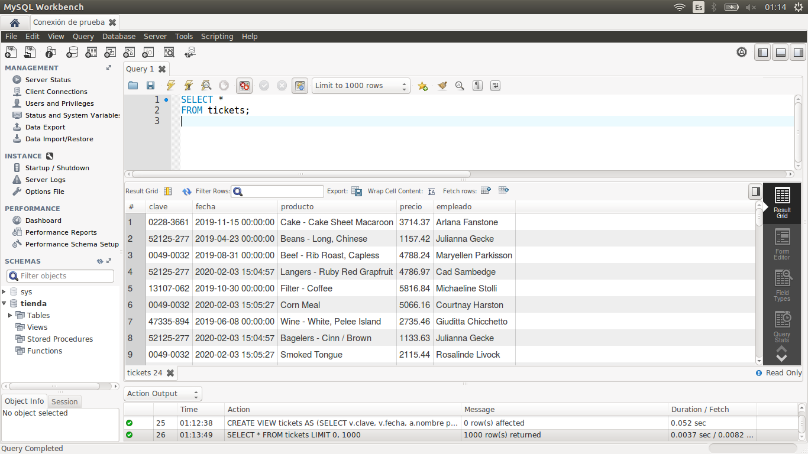

[`Introducción a Bases de Datos`](../../Readme.md) > [`Sesión 03`](../Readme.md) > `Ejemplo 2`

## Ejemplo 2: Definición de vistas

<div style="text-align: justify;">

### 1. Objetivos :dart:

- Crear vistas para preservar el contenido de una consulta.
- Consultas vistas como cualquier otra tabla.

### 2. Requisitos :clipboard:

1. MySQL Workbench instalado.

### 3. Desarrollo :rocket:

1. Abre MySQL Wokbench y conectate a la base de datos del curso.

2. Una vista permite preservar los resultados obtenidos mediante una consulta. Esto es útil pues no se tienen que estar reescribiendo relaciones, agrupando resultado, ordenando los registros, etc. La vista se almacena en memoria como si fuera una tabla cualquiera. 

   Por ejemplo, la tabla que almacena las ventas, puede relacionarse con los empleados y los artículo. Podemos crear una vista que almacene esta relación como si fuera un *ticket*.
   
   Lo primero será, definir la consulta.

   ```sql
   SELECT v.clave, v.fecha, a.nombre producto, a.precio, concat(e.nombre, ' ', e.apellido_paterno) empleado 
   FROM venta v
   JOIN empleado e
     ON v.id_empleado = e.id_empleado
   JOIN articulo a
     ON v.id_articulo = a.id_articulo;
   ```
   
   
   
   Ahora crearemos la vista con la instrucción `CREATE VIEW`. Le daremos el nombre `tickets`.
    
   ```sql
   CREATE VIEW tickets AS
   (SELECT v.clave, v.fecha, a.nombre producto, a.precio, concat(e.nombre, ' ', e.apellido_paterno) empleado 
   FROM venta v
   JOIN empleado e
     ON v.id_empleado = e.id_empleado
   JOIN articulo a
     ON v.id_articulo = a.id_articulo);
   ```
   
3. Ahora que se ha creado la vista, pueden realizarse consultas sobre la misma al igual que con cualquier tabla.

   ```sql
   SELECT *
   FROM tickets;
   ```

   
 
   ```sql
   SELECT clave, round(sum(precio),2) total
   FROM tickets
   GROUP BY clave;	
   ```
   
   

[`Anterior`](../Readme.md#definición-de-vistas) | [`Siguiente`](../Reto-02/Readme.md)

</div>   
