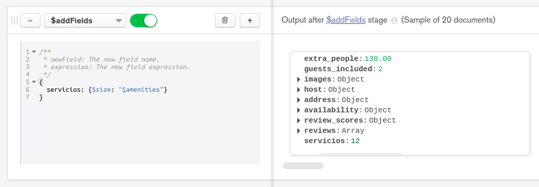
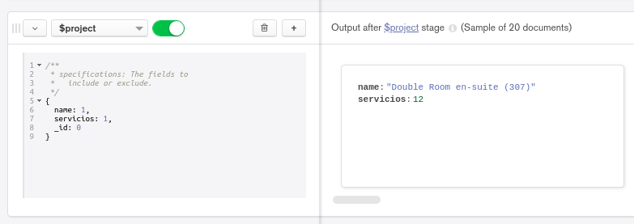
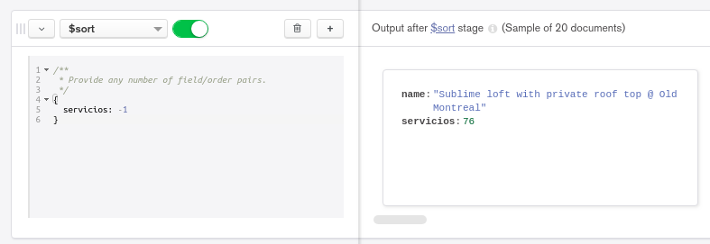
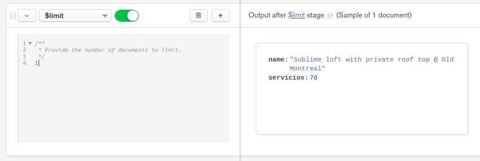

[`Introducción a Bases de Datos`](../../Readme.md) > [`Sesión 05`](../Readme.md) > `Ejemplo 3`

## Ejemplo 3: Introducción a las agregaciones

<div style="text-align: justify;">

### 1. Objetivos :dart: 

- Entender el concepto de agregación y su similitud con los agrupamientos y subconsultas de __SQL__.

### 2. Requisitos :clipboard:

1. MongoDB Compass instalado.

### 3. Desarrollo :rocket:

Cuando revisamos __SQL__ usamos agrupamientos que aplicaban una función a una columna reduciéndola a un valor que podía ser una suma, un conteo o calcular un promedio, por ejemplo. 

En __MongoDB__ podemos realizar lo mismo mediante el uso de agregaciones. Las agregaciones, permiten realizar distintos filtros usando *capas*. Una capa es el resultado de la aplicación de algún filtro, proyección, agrupamiento, ordenamiento, etc. Cada capa puede usarse en una nueva capa. La primera capa siempre será la colección completa.

Al conjunto de capas generadas en una agregación se le conoce como *pipeline*.

Por ejemplo, queremos saber cuál es la propiedad con mayor número de servicios (`amenities`) de la colección `sample_airbnb.listingsAndReviews`. Para usar agregaciones, daremos clic en la pestaña `Aggregations` de Compass. 

- Primero debemos obtener la longitud del arreglo `amenities` para saber el número de servicios de cada documento. Para esto, seleccionamos `addFields` en la primera capa.

   Con `addFields` podemos agregar campos como resultado de aplicar funciones a otros campos de la colección. De esta forma agregaremos el tamaño del arreglo como columna.
   
   Llamaremos a este campo servicios y para calcularlo usaremos la función `$size`. 
   
   ```json
   {
      servicios: {$size: "$amenities"}
   }
   ```
   
   
   
- Como el único dato que nos interesa es el número de servicios, sólo proyectaremos este resultado, para esto crearemos una nueva capa con `ADD STAGE` y elegiremos `$project`. Proyectamos el campo `name` y  `servicios` poniendo un `1` y quitamos el campo `_id` poniendo un 0.

   ```json
   {
      name: 1,
      servicios: 1,
      _id: 0
   }
   ```
   
   
   
- Ahora lo ordenamos añadiendo otra capa y usando `$sort`, recuerda -1 para descendente, 1 para ascendente.

   ```json
   {
      servicios: -1
   }
   ```
   
   
   
- Finalmente, limitamos la consulta a un registro usando `$limit`.

   ```json
   {
      1
   }
   ```
   
   

[`Anterior`](../Readme.md#introducción-a-las-agregaciones) | [`Siguiente`](../Reto-03/Readme.md)

</div>
