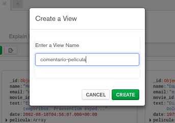
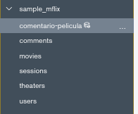
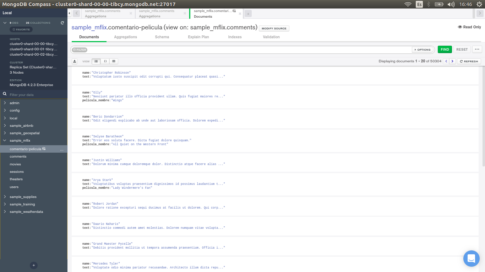

[`Introducción a Bases de Datos`](../../Readme.md) > [`Sesión 06`](../Readme.md) > `Ejemplo 3`

## Ejemplo 3: Generación de vistas

### 1. Objetivos :dart: 

- Construir vistas a partir de los resultados obtenidos de un *pipeline*.

### 2. Requisitos :clipboard:

1. MongoDB Compass instalado.

### 3. Desarrollo :rocket:

Con base en lo resultados del *pipeline* del Ejemplo 2, vamos a construir una vista que guarde los resultados. Una vista en __MongoDB__ funciona de manera similar a las vistas de __SQL__. Se genera una colección virtual que puede consultarse como si se tratara de una colección real.

Para crear una vista, damos clic en el botón `SAVE`.

Posteriormente damos un nombre a la vista y presionamos el botón `GUARDAR`.

En el menú izquierdo, aparece nuestra vista creada.

Si la abrimos, podemos notar que la consulta se realiza como a cualquier otra colección.

[`Anterior`](../Readme.md#generación-de-vistas) | [`Siguiente`](../Reto-03/Readme.md)   
