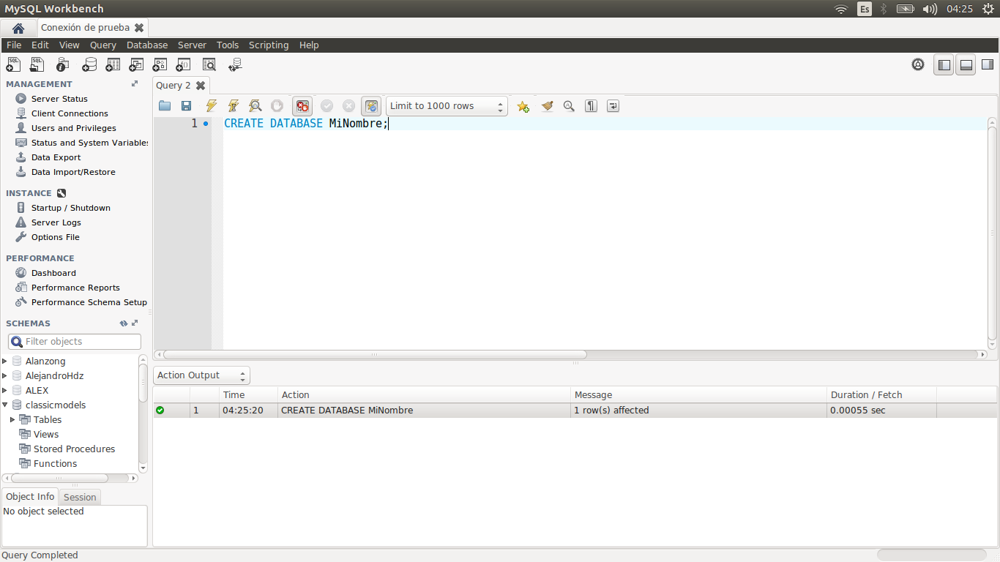
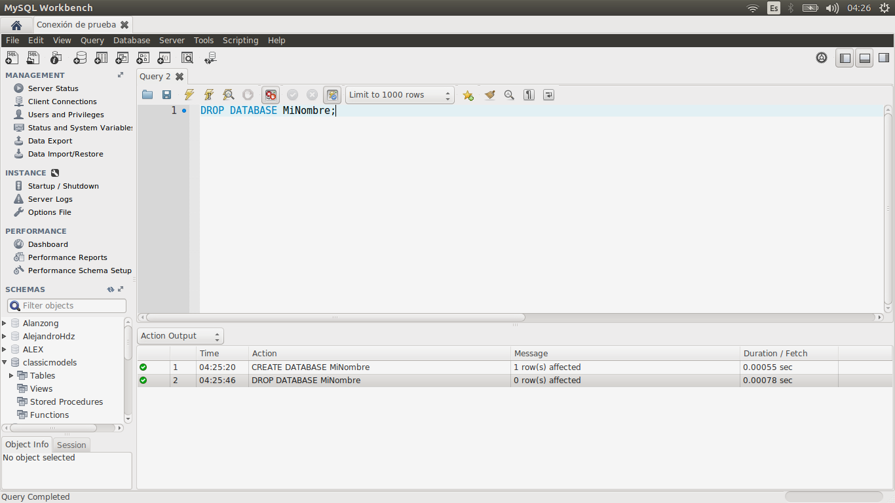
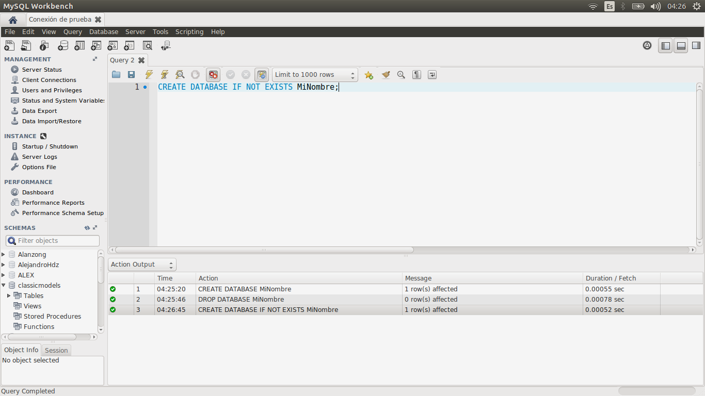

[`Introducción a Bases de Datos`](../../Readme.md) > [`Sesión 07`](../Readme.md) > Ejemplo 1

## Ejemplo 1: Operaciones con bases de datos

<div style="text-align: justify;">

### 1. Objetivos :dart: 
- Conectarse a un __MySQL__	localmente.
- Conocer las operaciones sobre bases de datos.

### 2. Requisitos :clipboard:
- Servidor de __MySQL__ instalado y ejecutándose en tu equipo.

### 3. Desarrollo :rocket:

---

 

:warning: <ins>**IMPORTANTE**</ins>

_En este ejemplo trabajaremos con la instancia de __MySQL__ que instalaste y configuraste en el *Prework* de la sesión_.

_NO REALICES LOS EJEMPLOS NI RETOS EN EL SERVIDOR DE BEDU._ :pray: 

_Si no sigues esta indicación... ¡Hay Tabla!_ :eyes:

---

1. Conectate a tu base de datos desde __MySQL Workbench__ con las credenciales correspondientes a la configuración de tu servidor.

1. Para crear una base de datos se usa la instrucción `CREATE DATABASE Nombre`, donde `Nombre` suele ser el nombre del proyecto, pero para el curso usa tú nombre y un apellido o un seudónimo en redes sociales que prefieras.

   

   El resultado indica que el comando se ejecutó de forma correcta, la cantidad de líneas o renglones afectados y el tiempo de ejecución.

   **Sugerencia.**  Cuando este comando sea usado con *scripts* para automatizar tareas, se sugiere usar la siguiente variante:
   
   ```sql
   CREATE DATABASE IF NOT EXISTS Nombre;
   ```

   para evitar que se genere un error en caso de que la base de datos ya exista y se intente crear de nuevo.

1. Para borrar una base de datos se usa el comando  `DROP DATABASE Nombre`
   
   

   **Sugerencia.**  Cuando este comando sea usado con scripts para automatizar tareas, se sugiere usar la siguiente variante:

   ```sql
   DROP DATABASE IF EXISTS Nombre;
   ```

   para evitar que se genere un error en caso de que la base de datos ya no exista y se intente borrar de nuevo.

1. Como paso final, se creará nuevamente la base de datos y se hará uso de ella como la base de datos actual, para ello se usará el comando `USE Nombre`

   

[`Anterior`](../Readme.md#operaciones-con-bases-de-datos) | [`Siguiente`](../Readme.md#realizando-operaciones-con-tablas)      

</div>
